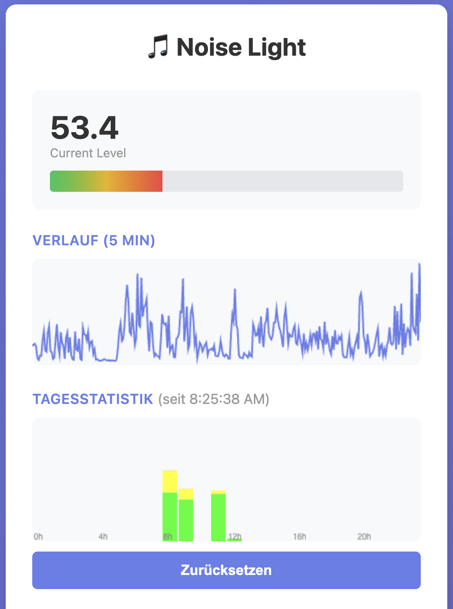
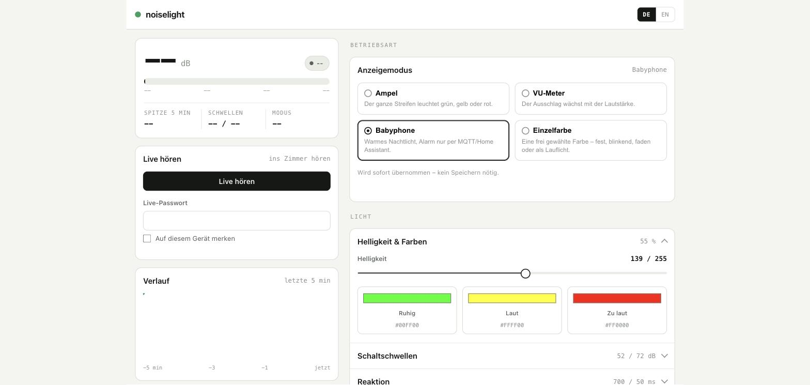

🇩🇪 [Deutsch](#deutsch) | 🇬🇧 [English](#english)

## Deutsch

# noiselight 🚦

Ein Echtzeit-Lärmmonitor, der den Geräuschpegel als Ampel mit RGB-LEDs anzeigt.

> ✅ **Status:** Alle unten beschriebenen Funktionen wurden auf echter Hardware getestet,
> einschließlich der Home Assistant / MQTT-Discovery-Integration und des
> browserbasierten OTA-Updates (inkl. Neustart in die neu geflashte Firmware, mehrfach
> über einen Stromzyklus hinweg bestätigt).

<details>
<summary><strong>Inhaltsverzeichnis</strong></summary>

- [📋 Funktionen](#de-funktionen)
- [🛒 Verwendete Hardware](#de-verwendete-hardware)
- [💻 Kompatible Hardware](#de-kompatible-hardware)
- [🔧 Hardware-Einrichtung](#de-hardware-einrichtung)
- [🖨️ Gehäuse (3D-Druck)](#de-gehaeuse)
- [📊 Funktionsweise](#de-funktionsweise)
- [🎚️ Konfiguration](#de-konfiguration)
- [🌐 WiFi- und Web-Konfiguration](#de-wifi-web-konfiguration)
- [🏠 MQTT- / Home-Assistant-Integration](#de-mqtt-ha)
- [🔑 Passwörter](#de-passwoerter)
- [📡 OTA-Updates (Over-the-Air)](#de-ota)
- [🚀 Bauen und Hochladen](#de-bauen-hochladen)
- [📈 Serielle Ausgabe](#de-serielle-ausgabe)
- [🔧 Kalibrierung](#de-kalibrierung)
- [🔴 Fehlerbehebung](#de-fehlerbehebung)
- [📚 Referenzen](#de-referenzen)
- [📝 Lizenz](#de-lizenz)

</details>

<a id="de-funktionen"></a>
## 📋 Funktionen

- **Echtzeit-Geräuscherkennung** über ein I2S-MEMS-Mikrofon
- **3-farbige Ampelanzeige**:
  - 🟢 **GRÜN** – Geräusch ist leise (unter dem Schwellenwert)
  - 🟡 **GELB** – Geräusch ist moderat (im mittleren Bereich)
  - 🔴 **ROT** – Geräusch ist laut (über dem Schwellenwert)
- **7er-NeoPixel-RGB-LED-Streifen** für helle, gut sichtbare Rückmeldung
- **A-bewertete Schallpegelmessung** (dBA) für eine realistische Wahrnehmung
- **Konfigurierbare Schwellenwerte** über persistenten Speicher
- **WiFi-Client-Modus** mit automatischem AP-Fallback für die Ersteinrichtung
- **Babyphone-Modus** – warmes, dimmbares Nachtlicht am Gerät, während ein anhaltend
  lauter Pegel (Auslöseschwelle + Halte-/Löschzeit mit Hysterese) einen Alarm
  ausschließlich per MQTT an Home Assistant meldet; die LED selbst bleibt ruhig
- **Live-Hören** – 16-kHz-PCM-Audiostream direkt im Browser, eigener TCP-Port, eigenes
  Passwort, mit Auto-Gain, damit auch leise Geräusche hörbar sind
- **MQTT- / Home-Assistant-Integration** mit MQTT-Discovery
- **Over-the-Air (OTA) Firmware-Updates**, sobald das Gerät mit dem Heimnetzwerk verbunden ist — per PlatformIO/ArduinoOTA **oder** direkt per Datei-Upload im Web-UI, ganz ohne Entwicklungsumgebung
- **Konfigurations-Export/Import** zum Sichern oder Klonen der Geräteeinstellungen
- **5-Minuten-Verlaufsdiagramm** im Web-UI
- **Firmware-Version** sichtbar im Web-UI-Footer und über MQTT (Diagnose-Topic mit Uptime, freiem Speicher, WLAN-Signalstärke, IP-Adresse und letztem Reset-Grund)
- **"Letzter Alarm"-Zeitstempel** über MQTT (Home-Assistant-Timestamp-Entity, zeigt automatisch "vor X Minuten" an)
- **Zwei getrennte Passwörter** – eins fürs Firmware-Flashen, eins fürs Live-Hören, damit
  das Weitergeben des einen nicht das andere mit verschenkt

<a id="de-verwendete-hardware"></a>
## 🛒 Verwendete Hardware

Diese Teile habe ich selbst gekauft (Amazon.de, Stand: wie unten verlinkt):

| Komponente | Preis | Hinweis | Link |
|-----------|-------|---------|------|
| LED | 18€ (5er-Pack, 3,60€/Stk.) | WS2812 RGB-LED-Ring, 7×5050 mit integrierten Treibern | [Amazon](https://www.amazon.de/dp/B09K57Y9FL?ref=ppx_yo2ov_dt_b_fed_asin_title) |
| Board | 20€ (2er-Pack, 10,00€/Stk.) | Waveshare ESP32-S3 Mini Development Board | [Amazon](https://www.amazon.de/dp/B0CSK8B4GS?ref=ppx_yo2ov_dt_b_fed_asin_title) |
| Mikrofon | 9€ (3er-Pack, 3,00€/Stk.) | INMP441 omnidirektionales Mikrofonmodul, 24-Bit I2S | [Amazon](https://www.amazon.de/dp/B0DX1VMRK1?ref_=ppx_hzsearch_conn_dt_b_fed_asin_title_2) |

Grobe Gesamtkosten für **ein** komplettes Gerät (je ein LED-Ring + Board + Mikrofon):
3,60€ + 10€ + 3€ ≈ **16,60€ pro Gerät**.

Da alle drei Teile im Mehrfach-Pack verkauft werden, lassen sich mit den übrigen Teilen
mehrere weitere Geräte bauen, ohne viel mehr als für ein einzelnes zu bezahlen. Preise
und Verfügbarkeit entsprechen dem Stand, als die Links hinzugefügt wurden, und können
sich ändern. Die Links sind normale Amazon-Links (kein Affiliate-Tracking durch dieses
Projekt) — einfach das, was ich selbst gekauft habe.

<a id="de-kompatible-hardware"></a>
## 💻 Kompatible Hardware

Dieses Projekt ist auf **ESP32** zugeschnitten — nicht auf ESP8266 oder andere
Mikrocontroller. Es nutzt ESP32-spezifische Peripherie (I2S für das Mikrofon, RMT für
die WS2812-LEDs) sowie FreeRTOS-Multitasking über zwei Kerne. Mindestanforderungen an
ein Ersatz-/Alternativboard:

- **Chip:** ESP32 (Xtensa- oder RISC-V-Varianten wie S3/C3) mit I2S- und
  RMT-Peripherie. Getestet auf **ESP32-S3**; andere ESP32-Varianten mit passender
  Pinbelegung sollten ebenfalls funktionieren, sind aber ungetestet.
- **Flash:** mindestens **4 MB**. Die OTA-Partitionstabelle (`default.csv`) braucht
  zwei App-Partitionen à ~1,25 MB für abwechselndes Flashen — die aktuelle Firmware
  belegt davon bereits ~86 % einer Partition, kleinere Flash-Größen reichen nicht.
- **RAM:** die üblichen ~320 KB internes SRAM eines ESP32(-S3) reichen locker (aktuell
  ~31 % Auslastung zur Laufzeit); **PSRAM wird nicht benötigt**.
- **WLAN:** 2,4-GHz-WiFi (Pflicht für Web-UI, MQTT und OTA).
- **USB:** Natives USB-CDC (wie beim ESP32-S3) vereinfacht Flashen und seriellen
  Monitor erheblich, ist aber kein Hard-Requirement — ein Board mit klassischer
  USB-UART-Brücke funktioniert auch, dann greift aber die Log-Umleitung in
  `include/config.h` nicht (die ist speziell für Boards ohne UART-Brücke gedacht,
  siehe Kommentar dort).

**Nicht kompatibel:** ESP8266 (kein I2S/RMT, kein FreeRTOS-Multicore, andere
Partitionierung) sowie generische AVR-/STM32-Boards ohne ESP-IDF-Unterstützung.

<a id="de-hardware-einrichtung"></a>
## 🔧 Hardware-Einrichtung

### Pin-Konfiguration

| Komponente | Pin | Farbe | Beschreibung |
|-----------|-----|-------|-------------|
| **WS2812 LED-Daten** | GPIO 1 | - | NeoPixel-Streifen (7 LEDs) |
| **I2S L/R Select** | GPIO 3 | Grün | Mikrofon-Kanalauswahl (HIGH = RECHTER Kanal) |
| **I2S Word Select** | GPIO 4 | Blau | Mikrofon L/R-Takt |
| **I2S Serial Clock** | GPIO 5 | Weiß | Mikrofon-Bittakt |
| **I2S Serial Data** | GPIO 2 | Gelb | Mikrofon-Audiodaten |
| **Modus-Taster** | GPIO 6 | - | Taster gegen GND (interner Pull-up, aktiv LOW) |
| **Stromversorgung (5V)** | 5V | - | USB-Netzteil |
| **GND** | GND | - | Masse |

### Modus-Taster

Ein optionaler Taster an GPIO 6 (gegen GND) erlaubt Bedienung ohne WebUI:

- **Kurzer Druck**: schaltet den Anzeigemodus weiter (Ampel → VU-Meter → Babyphone →
  Einfarbig → Ampel …)
- **Langer Druck (gehalten, >600 ms)**: rampt die LED-Helligkeit hoch/runter; an den
  Grenzen (0/255) dreht die Richtung automatisch um (Ping-Pong). Beim Loslassen wird
  der erreichte Wert dauerhaft gespeichert.

Ist kein Taster angeschlossen, bleibt GPIO 6 dank internem Pull-up dauerhaft HIGH und
es passiert nichts - die Funktion ist also optional und stört ohne Hardware nicht.

<a id="de-gehaeuse"></a>
## 🖨️ Gehäuse (3D-Druck)

Die 3D-Druckdateien liegen in [`3dprinting/`](./3dprinting) (Fusion-360-Quelldatei
sowie fertige `.3mf`-Projekte für Base, Cover, Visor, LED-Mount, ESP-Mount, Standfüße,
Linse und Reflektor). Details zu Druckprofilen findest du in
[`3dprinting/README.md`](./3dprinting/README.md).

In der Praxis gedruckt: die **Linse** in **PETG, transluzent**, damit das Licht schön
diffus streut - der Rest des Gehäuses (Base, Cover, Visor, LED-Mount, ESP-Mount,
Standfüße) in **PLA**. Das weicht vom in `3dprinting/README.md` hinterlegten
Bambu-Studio-Profil ab (dort ist z. B. PETG/TPU für die übrigen Teile vorgesehen) -
PLA hat sich für den Innenausbau als völlig ausreichend erwiesen, da das Gehäuse keiner
Wärme- oder mechanischen Belastung ausgesetzt ist.

<a id="de-funktionsweise"></a>
## 📊 Funktionsweise

### Audio-Verarbeitungspipeline

1. **I2S-Abtastung** (48 kHz, 32-Bit)
   - Erfasst kontinuierlich Audio vom Mikrofon
   - Hochpräzise digitale Abtastung

2. **IIR-Filterung**
   - **Equalizer-Filter** (INMP441): Glättet den Frequenzgang des Mikrofons
   - **A-Bewertungsfilter**: Bildet die Empfindlichkeit des menschlichen Ohrs nach
     (betont mittlere Frequenzen)

3. **Schallpegelberechnung**
   - Wandelt gefilterte Samples in dB (Dezibel) um
   - Nutzt die Mikrofonkalibrierung aus `MIC_REF_DB`/`MIC_SENSITIVITY`
   - **Messfenster: 125 ms** (`SAMPLES_SHORT` = 6000 Samples bei 48 kHz). Das ist
     exakt die Zeitbewertung **"FAST" nach IEC 61672**, die auch jeder handelsübliche
     Schallpegelmesser verwendet — deshalb ist der Wert nicht frei wählbar, ohne die
     Kalibrierung zu entwerten
   - Gelesen wird allerdings in **zwei 62,5-ms-Halbblöcken** (`SAMPLES_CHUNK`), deren
     Quadratsummen addiert werden, bevor ein Messwert entsteht. Die IIR-Filter tragen
     ihren Zustand über den Aufruf hinaus, das Ergebnis ist also bitgleich zu einem
     durchgehenden 125-ms-Block — halbiert aber den Sample-Puffer von 24 KB auf 12 KB
   - Anschließend exponentielle Glättung (α = 0,3 pro Fenster, Zeitkonstante ≈ 350 ms)

4. **Entscheidungslogik**
   ```
   if (dB < db_normal_switchover)      → GRÜN   (ruhig)
   if (dB < db_warning_switchover)     → GELB   (laut)
   sonst                               → ROT    (zu laut)
   ```

<a id="de-konfiguration"></a>
## 🎚️ Konfiguration

### Standardwerte

Alle in `include/config.h`, zur Laufzeit über das Web-UI änderbar und im NVS persistent:

```cpp
DB_FLOOR                   37.0   // Grundpegel (unteres Ende der VU-Skala)
DB_NORMAL_SWITCHOVER       50.0   // darunter GRÜN, darüber GELB
DB_WARNING_SWITCHOVER      65.0   // darunter GELB, darüber ROT
LED_BRIGHTNESS               25   // 0-255
DISPLAY_MODE                  1   // 0=Ampel, 1=VU-Meter, 2=Babyphone

BABYPHONE_TRIGGER_DB       65.0   // Schwelle, die anhaltend überschritten werden muss
BABYPHONE_SUSTAIN_MS       5000   // so lange darüber → Alarm
BABYPHONE_CLEAR_MS         3000   // so lange darunter → Alarm gelöscht
BABYPHONE_NIGHT_COLOR  0xFF3C00   // warmes Bernstein, fast ohne Blauanteil
BABYPHONE_NIGHT_BRIGHTNESS   15   // 0-255, gedimmt
```

### Empfohlene Einstellungen

| Umgebung | Grün→Gelb | Gelb→Rot | Hinweise |
|------------|--------|--------|-------|
| Bibliothek/Ruhig | 30 | 50 | Sehr leise Räume |
| Klassenzimmer | 40 | 60 | Normaler Unterricht |
| Aktives Klassenzimmer | 45 | 70 | Gruppenarbeitsphasen |
| Werkstatt | 60 | 80 | Toleriert Maschinenlärm |
| Kinderzimmer (Babyphone) | 45 | 65 | Auslöseschwelle separat einstellen |

### Wissenschaftliche Grundlage der Standardwerte

Die Werkseinstellungen (Grün→Gelb bei **50 dB**, Gelb→Rot bei **65 dB**) sind keine
Zufallszahlen, sondern orientieren sich an anerkannten Lärmwirkungs-Richtwerten:

- **50 dB (Grün→Gelb):** Die WHO nennt in den *Guidelines for Community Noise* (1999,
  Tabelle 4.1) 50 dB LAeq als Richtwert, ab dem in Wohn-/Aufenthaltsräumen mit
  **moderater Belästigung** zu rechnen ist ("outdoor living area", moderate annoyance).
  Oberhalb dieses Pegels beginnt Lärm subjektiv als störend wahrgenommen zu werden.
- **65 dB (Gelb→Rot):** Normale Unterhaltungssprache liegt laut NIDCD/CDC-Referenztabellen
  bei etwa 60–70 dB(A) (1 m Abstand). Die WHO-Richtlinie weist darauf hin, dass oberhalb
  eines Hintergrundpegels von rund 65 dB die Sprachverständlichkeit deutlich leidet und
  die Stimme angehoben werden muss, während gleichzeitig laut Tabelle 4.1 die Schwelle zur
  **ernsten Belästigung** ("serious annoyance") erreicht wird.
- Zum Einordnen: **Gehörschäden** durch Dauerlärm sind erst bei deutlich höheren Pegeln
  relevant — NIOSH empfiehlt max. 85 dB(A) über 8 Std. (REL), OSHA erlaubt gesetzlich
  max. 90 dB(A) über 8 Std. (PEL). ROT markiert hier also eine **Komfort-/Konzentrations-
  Warnschwelle**, nicht bereits eine Gehörschäden-Warnung — dafür liegen die Pegel weit
  genug auseinander, dass ROT als früher, harmloser Hinweis taugt.
- Für spezielle Umgebungen (Klassenzimmer, Kinderzimmer) empfiehlt die WHO strengere
  Innenraum-Richtwerte (z. B. 35 dB LAeq in Klassenzimmern zur Sprachverständlichkeit,
  30 dB LAeq nachts im Schlafzimmer) — diese liegen jedoch so nah am technischen
  Grundrauschen des Mikrofons (`DB_FLOOR` ≈ 37 dB), dass eine LED-Ampel bei diesen engen
  Werten kaum noch sinnvoll zwischen "Grün" und "Gelb" unterscheiden könnte. Die
  Empfehlungen in der Tabelle oben sind deshalb praxisnah nach oben verschobene
  Näherungswerte, keine 1:1-Übernahme der WHO-Innenraumwerte.

**Quellen:**
- WHO (1999): [*Guidelines for Community Noise*](https://www.who.int/publications/i/item/a68672), Tabelle 4.1 (Richtwerte für spezifische Umgebungen)
- WHO Regional Office for Europe (2018): [*Environmental Noise Guidelines for the European Region*](https://cdn.who.int/media/docs/default-source/who-compendium-on-health-and-environment/who_compendium_noise_01042022.pdf)
- NIOSH: [*Criteria for a Recommended Standard – Occupational Noise Exposure*](https://www.nonoise.org/hearing/criteria/criteria.htm) (REL 85 dB(A)/8h)
- OSHA: [*Occupational Noise Exposure*](https://www.osha.gov/noise) (PEL 90 dB(A)/8h)

<a id="de-wifi-web-konfiguration"></a>
## 🌐 WiFi- und Web-Konfiguration

### WiFi-Modi

Das Gerät verbindet sich mit deinem Heimnetzwerk als **WiFi-Client (STA)**. Falls beim
Start noch kein Netzwerk konfiguriert ist oder das konfigurierte Netzwerk nicht
erreichbar ist, fällt es auf seinen eigenen **Access Point (AP)** zurück, sodass du das
Web-UI immer erreichen kannst:

- **SSID (Netzwerkname):** `noiselight`
- **Passwort:** `12345678`
- **IP-Adresse:** `192.168.4.1`
- **Port:** `80` (HTTP)

Sobald das Gerät mit dem Heimnetzwerk verbunden ist, ist es außerdem per mDNS unter
**`http://noiselight.local`** erreichbar.

### Erststart-WiFi über .env (optional)

Falls dein Smartphone/Laptop den `noiselight`-AP nicht sehen oder nicht beitreten kann,
oder du diesen Schritt lieber ganz überspringen möchtest, kopiere `.env.example` nach
`.env` (in .gitignore, wird nie committet) und trage deine Heim-WiFi-Zugangsdaten ein:

```bash
cp .env.example .env
# edit .env: WIFI_SSID=..., WIFI_PASSWORD=...
platformio run -t upload -e esp32-s3-devkitc1-n4r2
```

`load_env.py` bettet diese Werte als NVS-Standard ein, den ein frisch geflashtes Gerät
bei seinem allerersten Start verwendet — das ist nur relevant, bis die WiFi-Einstellungen
des Geräts einmal über das Web-UI gespeichert wurden (oder bereits aus einem früheren
Flash-Vorgang im NVS vorhanden sind); danach gewinnt immer der im NVS gespeicherte Wert
gegenüber dem `.env`-Standard.

### Einrichtungsschritte

1. **Erstverbindung (AP-Fallback):**
   - Öffne die WiFi-Einstellungen deines Geräts (Smartphone, Tablet, Laptop)
   - Wähle das Netzwerk `noiselight`
   - Gib das Passwort ein: `12345678`

2. **Konfigurationsseite öffnen:**
   - Öffne einen Browser und gehe zu: `http://192.168.4.1`
   - Das Web-Interface lädt automatisch

3. **Heim-WiFi beitreten:**
   - Trage SSID/Passwort deines Netzwerks im Bereich **Network** des Web-UI ein und
     speichere
   - Das Gerät verbindet sich mit deinen Zugangsdaten neu; bei Erfolg beendet es den AP
     und ist fortan unter `http://noiselight.local` (oder seiner neuen DHCP-Adresse)
     erreichbar
   - Schlägt die Verbindung fehl, fällt das Gerät wieder in den AP-Modus zurück, sodass
     du nie ausgesperrt wirst

4. **Einstellungen in Echtzeit konfigurieren:**
   - Live-dB-Pegelanzeige aktualisiert sich alle 200 ms
   - Alle Schieberegler aktualisieren die Vorschau sofort
   - Drücke **Save Configuration**, um die Einstellungen im Gerätespeicher zu sichern

### Web-Interface-Funktionen


*Live-dB-Anzeige, Verlaufsgraph und Betriebsart-Auswahl (Ampel / VU-Meter / Babyphone / Einzelfarbe)*


*Ausgeklappte Lichteinstellungen: Helligkeit sowie Farben für Ruhig/Laut/Zu laut*

**Anzeigemodus**
- **Ampel:** Alle LEDs zeigen eine einzelne Farbe (GRÜN/GELB/ROT)
- **VU-Meter:** LEDs bilden einen Verlaufsbalken, der die Geräuschintensität zeigt
- **Babyphone:** Der Streifen ist ein statisches, warmes Nachtlicht und reagiert
  bewusst *nicht* auf Geräusche. Der Alarm läuft ausschließlich über MQTT — die
  Beleuchtung im Kinderzimmer soll nicht blinken, wenn das Kind weint

**Live hören**
- Eigene Karte direkt unter der Pegelanzeige, in **jedem** Anzeigemodus verfügbar
- Streamt 16-kHz-PCM-Mono über einen eigenen TCP-Port (8081, `AUDIO_STREAM_PORT`) und
  spielt es über die Web-Audio-API im Browser ab
- Geschützt durch `LIVE_PASSWORD` — nicht durch das OTA-Passwort (siehe
  **Passwörter** weiter unten). Optional per Häkchen im Browser merkbar
- Ein Auto-Gain skaliert jeden Block auf einen Zielpegel (Attack sofort, Release
  verzögert), weil das Mikrofon für *Messgenauigkeit* kalibriert ist und ein leises
  Wimmern sonst kaum hörbar wäre
- Jeweils nur ein Zuhörer gleichzeitig; ein zweiter Verbindungsversuch wird mit
  "503 stream busy" abgewiesen. Der Ringpuffer wird erst beim Verbinden alloziert
  und beim Trennen wieder freigegeben

**LED-Einstellungen**
- **Helligkeit:** 0–255 (Standard: 25)
- **Farbauswahl:** Individuelle Farben für jede Lärmstufe wählen

**Umschaltpunkte (dB)**
- **Grundpegel:** Geräusch-Grundpegel (Standard: 37 dB)
- **Grün→Gelb:** Übergangsschwelle (Standard: 50 dB)
- **Gelb→Rot:** Alarmschwelle (Standard: 65 dB)
- **Farbvorschau:** Visueller Balken zeigt LED-Farben über den dB-Bereich

**Reaktionszeiten**
- **Nachleuchten:** Wie lange die aktuelle Farbe gehalten wird, nachdem der Ton
  aufgehört hat (0–3000 ms, Standard: 1500 ms)
- **Ansprechzeit:** Minimales Aktualisierungsintervall zwischen LED-Wechseln
  (0–500 ms, Standard: 100 ms). Gilt für Ampel *und* VU-Meter; letzteres hat
  zusätzlich eine harte Untergrenze von 20 ms, weil ein WS2812-Streifen darüber
  hinaus ohnehin nicht sinnvoll aktualisiert werden kann

**Babyphone-Einstellungen**
- **Auslöseschwelle** (dB), **Anhaltend für** (s) und **Löscht nach** (s) bilden einen
  Zustandsautomaten mit asymmetrischer Hysterese: der Alarm feuert erst nach einer
  ununterbrochen lauten Phase und löscht sich erst nach einer ununterbrochen leisen —
  ein kurzes Luftholen zwischen zwei Schreien setzt also nichts zurück
- **Nachtlicht-Farbe** und **-Helligkeit** für den Streifen in diesem Modus

**Verlaufsdiagramm**
- Live-Liniendiagramm der letzten 5 Minuten der dB-Messwerte (1 Sample/Sek.), bereitgestellt
  über `/api/history`

**Tagesstatistik (tägliche Zeitverteilung)**
- Gestapeltes Balkendiagramm, das zeigt, wie viel Zeit jeder Stunde (heute, 24 Buckets)
  in welchem Farbzustand (NORMAL/WARNING/ALERT) verbracht wurde, bereitgestellt über
  `/api/hourly`
- Setzt sich automatisch um Mitternacht (Ortszeit) zurück; ein **Zurücksetzen**-Button
  löscht sie auch manuell über `/api/hourly/reset`
- Erfordert, dass die Uhr des Geräts zuerst per NTP synchronisiert wurde (siehe
  **Zeitzone** unten) — bis dahin zeigt das Diagramm einen Hinweis statt Daten
- Die Einteilung in Buckets basiert auf der rohen (nicht gedämpften) Geräuschklassifizierung
  bei jedem Loop-Tick — derselben Klassifizierung, die MQTT als "level"-Sensor
  veröffentlicht — und nicht auf der anzeigegeglätteten Farbe, die ruhige Phasen
  unterbewerten würde

**Zeitzone**
- Der Bereich **Network** enthält ein Feld **Zeitzone (POSIX TZ)**, z. B.
  `CET-1CEST,M3.5.0,M10.5.0/3` (Europe/Berlin, Standard) oder `EST5EDT,M3.2.0,M11.1.0`
  (US-Ostküste) — wird direkt an die `configTzTime()`-Funktion des ESP32 übergeben,
  sodass die Stunden-Buckets der Tagesstatistik mit deiner lokalen Uhrzeit
  übereinstimmen, inklusive Sommerzeitumstellung
- Anders als ein fester UTC-Offset kodiert ein POSIX-TZ-String auch, *wann* sich die
  Uhr verschiebt (der Teil `M3.5.0,M10.5.0/3`), sodass Sommer-/Winterzeit automatisch
  gehandhabt wird — keine manuelle Anpassung zweimal im Jahr nötig
- Erfordert eine Internetverbindung (NTP-Sync gegen `pool.ntp.org`/`time.nist.gov`);
  greift nicht im AP-Fallback-Modus ohne Internetzugang

### Persistenter Speicher

Alle Konfigurationsänderungen werden automatisch im **NVS (Non-Volatile Storage)** des
ESP32 gespeichert:
- Einstellungen überstehen einen Stromausfall
- Werden beim Gerätestart automatisch geladen
- Konfiguration erreichbar über `/api/config`, WiFi-/MQTT-Einstellungen über
  `/api/network`

### Konfigurations-Export/Import

Das Web-UI kann die gesamte Gerätekonfiguration (LED-/Schwellenwert-Einstellungen
**und** WiFi-/MQTT-Zugangsdaten) als JSON-Datei über `/api/config/export` exportieren
und über `/api/config/import` auf einem anderen Gerät (oder nach einem Reset)
wiederherstellen. Praktisch, um eine funktionierende Einrichtung zu sichern oder auf
ein zweites Gerät zu klonen.

> ⚠️ Die exportierte Datei enthält deine WiFi- und MQTT-Passwörter im Klartext —
> behandle sie wie jede andere Zugangsdatendatei.

<a id="de-mqtt-ha"></a>
## 🏠 MQTT- / Home-Assistant-Integration

Sobald das Gerät mit dem Heimnetzwerk verbunden ist, kann es seine Lärmmesswerte an
einen MQTT-Broker senden und sich selbst über MQTT-Discovery bei **Home Assistant**
anmelden — keine manuelle Entitätskonfiguration nötig.

### Einrichtung

1. Trage im Bereich **Network** des Web-UI Host/Port deines MQTT-Brokers ein sowie,
   falls erforderlich, Benutzername/Passwort, und speichere.
2. Das Gerät verbindet sich automatisch und meldet sich per Discovery unter
   `homeassistant/<component>/<device-id>/...` an. Auf dem schnellen State-Topic
   (alle ~2 Sekunden, `noiselight/<device-id>/state`):
   - **Noise Level** – der aktuelle dB-Messwert, auf eine ganze Zahl gerundet
   - **Noise Level Status** – `normal` / `warning` / `alert`
   - **Anzeigemodus** – `traffic_light` / `vu_meter` / `babyphone`
   - **Babyphone Alarm** – `binary_sensor` (`device_class: sound`), spiegelt den
     Zustandsautomaten aus dem Babyphone-Modus. Bewusst auf dem 2-Sekunden-Topic und
     nicht bei der Diagnose, damit ein Alarm schnell in HA ankommt
3. Ein Verfügbarkeits-Topic (`.../availability`) sorgt dafür, dass Home Assistant das
   Gerät als offline markiert, wenn die Verbindung abbricht.
4. Ein Diagnose-Topic (`noiselight/<device-id>/debug`, alle 60 Sekunden) liefert als
   eigene "diagnostic"-Entitäten:
   - **Firmware Version**, **Uptime**, **WiFi Signal**, **IP Address**,
     **Last Reset Reason**
   - **Free Heap** – Summe *aller* freien Bytes
   - **Largest Free Block** – größter *zusammenhängender* Block. Zusammen mit Free Heap
     auf einer Karte macht das Fragmentierung sichtbar: bleibt Free Heap flach, während
     dieser Wert über Tage absackt, stanzt irgendwo eine malloc/free-Schleife Löcher in
     den Heap
   - **Letzter Alarm (Rot)** – Zeitstempel-Sensor, der automatisch anzeigt, wie lange
     der letzte Alarm-Zustand her ist

Die Geräte-ID wird aus den letzten 6 Hex-Ziffern der MAC-Adresse abgeleitet (z. B.
`noiselight-a1b2c3`).

<a id="de-passwoerter"></a>
## 🔑 Passwörter

Die Firmware kennt **zwei getrennte Zugangsdaten** (beide in `include/config.h`):

| Define | Standard | Schützt |
|---|---|---|
| `OTA_PASSWORD` | `changeme-ota` | ArduinoOTA (Flashen per PlatformIO/IDE) **und** `POST /update` im Web-UI |
| `LIVE_PASSWORD` | `changeme-live` | Live-Hören auf Port 8081 (`/listen`) |

Dazu `OTA_USERNAME` und `LIVE_USERNAME` (beide `admin`) für die HTTP-Basic-Auth der
zwei Endpunkte; ArduinoOTA selbst prüft nur das Passwort.

Warum getrennt: Firmware flashen kann das Gerät unbrauchbar machen und sollte bei dem
bleiben, der es wartet. Ins Zimmer hören ist dagegen eine Alltagshandlung für alle im
Haushalt — und die, die man um drei Uhr nachts halbwach auf dem Handy eintippt. Das
Live-Passwort weiterzugeben darf nicht bedeuten, das Recht zum Neuflashen mitzuverschenken.

> ⚠️ **Beide Standardwerte vor dem Einsatz im Heimnetz ändern.** Sie stehen im Klartext
> in diesem öffentlichen Repository.

Nur das Live-Passwort lässt sich im Browser per Häkchen "Auf diesem Gerät merken"
speichern (`localStorage`, im Klartext, gebunden an die Adresse des Geräts). Für das
OTA-Passwort gibt es diese Option bewusst nicht.

> **Hinweis:** Das Web-UI baut seine `Authorization`-Header in JavaScript, und dieser
> Code ist ein String-Literal in `src/web.cpp` — er sieht die `#define`s nicht. Die
> *Benutzernamen* stehen dort ein zweites Mal. Änderst du einen davon, musst du ihn an
> beiden Stellen ändern.

<a id="de-ota"></a>
## 📡 OTA-Updates (Over-the-Air)

Sobald das Gerät mit deinem Heimnetzwerk verbunden ist (STA-Modus), kann die Firmware
statt per USB über WiFi aktualisiert werden — mit der dedizierten
`esp32-s3-devkitc1-n4r2-ota`-PlatformIO-Umgebung:

```bash
platformio run -t upload -e esp32-s3-devkitc1-n4r2-ota
```

Dies lädt auf `noiselight.local` hoch und benötigt das in `include/config.h`
konfigurierte OTA-Passwort (`OTA_PASSWORD`, muss mit `upload_flags` in
`platformio.ini` übereinstimmen). **Ändere das Standardpasswort, bevor du das Gerät in
deinem Heimnetzwerk einsetzt** — sonst kann jeder im selben Netzwerk einen
OTA-Flash-Versuch starten. OTA ist erst nach einer erfolgreichen WiFi-STA-Verbindung
aktiviert; im AP-Fallback-Modus ist es nie erreichbar.

> **Toolchain-Hinweis:** `platformio.ini` pinnt die `espressif32`-Platform auf den
> [pioarduino](https://github.com/pioarduino/platform-espressif32)-Fork (Arduino-ESP32
> 3.3.11 / ESP-IDF 5.5.5) — bewusst dieselbe Core-Generation wie die Arduino-IDE-
> Installation. Der ESP32-S3-Bootloader hat App-Rollback aktiviert: ein per OTA
> geschriebenes Image muss vom selben Core-Generation stammen wie der Bootloader,
> sonst validiert das Image nicht und der Bootloader fällt beim nächsten Neustart
> stillschweigend auf die alte Partition zurück, ohne die neue Firmware auch nur
> einmal zu starten. Mit gepinntem `pioarduino` und einer Selbstbestätigung beim Boot
> (`esp_ota_mark_app_valid_cancel_rollback()` in `src/main.cpp`, sobald die laufende
> Partition auf "pending verify" steht) funktioniert OTA jetzt zuverlässig — mehrfach
> über einen echten Stromzyklus hinweg getestet.

**Browserbasiertes Hochladen:** Das WebUI hat außerdem einen eigenen Bereich
"Firmware-Update" zum direkten Hochladen einer `.bin`-Datei aus einem Browser-Tab,
ohne PlatformIO oder Arduino IDE. Der `/update`-Endpoint ist per HTTP Basic Auth
geschützt — Benutzername `admin` (`OTA_USERNAME`), Passwort `OTA_PASSWORD` (beide in
`include/config.h`). Trägst du im WebUI-Passwortfeld das richtige `OTA_PASSWORD` ein,
läuft der Upload direkt durch; rufst du `/update` ohne diese Zugangsdaten auf (oder ist
das Feld leer/falsch), fragt stattdessen der Browser selbst mit einem Login-Popup nach
Benutzername/Passwort. Fertige Binärdateien für diesen Weg liegen im Verzeichnis
[`firmware/`](firmware/) — eine `.bin` pro `FIRMWARE_VERSION`, automatisch von jedem
`pio run` gebaut.

<a id="de-bauen-hochladen"></a>
## 🚀 Bauen und Hochladen

### Voraussetzungen

- PlatformIO (VS-Code-Erweiterung oder CLI)
- Arduino IDE (optional, für direkte Kompilierung)

### Build

```bash
# Using PlatformIO
platformio run -e esp32-s3-devkitc1-n4r2

# Or in VS Code: Ctrl+Shift+B → Build
```

### Upload

```bash
# Using PlatformIO (USB)
platformio run -t upload -e esp32-s3-devkitc1-n4r2

# Or over WiFi, once on your home network (see OTA section above)
platformio run -t upload -e esp32-s3-devkitc1-n4r2-ota

# Or in VS Code: Ctrl+Shift+B → Upload
```

<a id="de-serielle-ausgabe"></a>
## 📈 Serielle Ausgabe

Das Gerät gibt dB-Messwerte über den seriellen Monitor aus (115200 Baud):

```
Leq: 45.3 dB | Min: 40 | Max: 60 | GREEN
Leq: 62.1 dB | Min: 40 | Max: 60 | RED
Leq: 55.2 dB | Min: 40 | Max: 60 | YELLOW
```

<a id="de-kalibrierung"></a>
## 🔧 Kalibrierung

### Mikrofonempfindlichkeit

Wenn die Messwerte durchgehend abweichen:

1. **Bekannten Schallpegel messen** (z. B. mit einer Smartphone-App)
2. **Mit der seriellen Ausgabe vergleichen**
3. **MIC_OFFSET_DB in `main.cpp` anpassen:**
   ```cpp
   #define MIC_OFFSET_DB 3.0103  // Increase/decrease calibration offset
   ```

<a id="de-fehlerbehebung"></a>
## 🔴 Fehlerbehebung

| Problem | Ursache | Lösung |
|-------|-------|----------|
| Immer GRÜN | Mikrofon nicht angeschlossen | I2S-Pins prüfen (GPIO 3, 5, 2) |
| Immer ROT | Kalibrierung falsch | MIC_OFFSET_DB anpassen |
| Keine serielle Ausgabe | Falsche Baudrate | Auf 115200 einstellen |
| Keine LED-Reaktion | Falscher LED-Pin | GPIO-1-Verbindung prüfen |
| Hoher Grundgeräuschpegel des Mikrofons | Elektrisches Rauschen | Datenleitungen abschirmen, Stromversorgung prüfen |
| Gerät bleibt am `noiselight`-AP hängen | Heim-WiFi nicht erreichbar/falsches Passwort | Zugangsdaten im Web-UI prüfen oder erneut mit dem AP verbinden und neu eingeben |
| MQTT-Entitäten erscheinen nicht in Home Assistant | Broker nicht erreichbar oder Discovery noch nicht gesendet | Host/Port/Zugangsdaten in den Netzwerkeinstellungen prüfen; Discovery wird bei jeder Neuverbindung erneut gesendet |
| OTA-Upload schlägt fehl/läuft in Timeout | Gerät im AP-Fallback oder falsches `--auth`-Passwort | Sicherstellen, dass das Gerät im Heimnetzwerk ist (`noiselight.local` löst auf) und `OTA_PASSWORD` mit `platformio.ini` übereinstimmt |

<a id="de-referenzen"></a>
## 📚 Referenzen

- **Original deciLight Project**: https://github.com/bbbenji/deciLight
- **FastLED Documentation**: http://fastled.io/
- **ESP-IDF I2S API**: https://docs.espressif.com/projects/esp-idf/en/latest/esp32/api-reference/peripherals/i2s.html
- **A-weighting Filter**: https://en.wikipedia.org/wiki/A-weighting
- **PubSubClient (MQTT)**: https://github.com/knolleary/pubsubclient
- **Home Assistant MQTT Discovery**: https://www.home-assistant.io/integrations/mqtt/#mqtt-discovery

<a id="de-lizenz"></a>
## 📝 Lizenz

Dieses Projekt startete als Fork von [deciLight](https://github.com/bbbenji/deciLight) (GPL-3.0).
Die Grundidee (ESP32 + I2S-Mikrofon + NeoPixel-Lichtsäule) und die I2S-Audio-Basis stammen von dort;
Web-UI, Netzwerk-Stack (WiFi STA/AP-Fallback, mDNS), MQTT/Home-Assistant-Integration und die
Audio-Pipeline wurden seitdem vollständig neu geschrieben. Lizenziert unter der GNU General Public
License v3.0.

---

## English

# noiselight 🚦

A real-time noise monitor that displays sound levels as a traffic light using RGB LEDs.

> ✅ **Status:** All features below have been tested on real hardware, including the
> Home Assistant / MQTT discovery integration and the browser-based OTA update
> (including rebooting into the newly flashed firmware, confirmed across a real power
> cycle, more than once).

<details>
<summary><strong>Table of Contents</strong></summary>

- [📋 Features](#en-features)
- [🛒 Hardware Used](#en-hardware-used)
- [💻 Compatible Hardware](#en-compatible-hardware)
- [🔧 Hardware Setup](#en-hardware-setup)
- [🖨️ Enclosure (3D Printing)](#en-enclosure)
- [📊 How It Works](#en-how-it-works)
- [🎚️ Configuration](#en-configuration)
- [🌐 WiFi & Web Configuration](#en-wifi-web-configuration)
- [🏠 MQTT / Home Assistant Integration](#en-mqtt-ha)
- [🔑 Passwords](#en-passwords)
- [📡 OTA (Over-the-Air) Updates](#en-ota)
- [🚀 Building & Uploading](#en-building-uploading)
- [📈 Serial Output](#en-serial-output)
- [🔧 Calibration](#en-calibration)
- [🔴 Troubleshooting](#en-troubleshooting)
- [📚 References](#en-references)
- [📝 License](#en-license)

</details>

<a id="en-features"></a>
## 📋 Features

- **Real-time noise detection** via I2S MEMS microphone
- **3-color traffic light display**:
  - 🟢 **GREEN** – Noise is low (quieter than threshold)
  - 🟡 **YELLOW** – Noise is moderate (within range)
  - 🔴 **RED** – Noise is high (exceeded threshold)
- **7 NeoPixel RGB LED strip** for bright, visible feedback
- **A-weighted sound level measurement** (dBA) for realistic perception
- **Configurable thresholds** via persistent storage
- **WiFi client mode** with automatic AP fallback for first-time setup
- **Babyphone mode** – a warm, dimmable night light on the device while a sustained
  loud level (trigger threshold plus hold/clear times with hysteresis) raises an alarm
  over MQTT to Home Assistant only; the LED itself stays calm
- **Live listening** – 16 kHz PCM audio stream straight in the browser, on its own TCP
  port with its own password, auto-gained so quiet sounds are audible too
- **MQTT / Home Assistant integration** with MQTT discovery
- **Over-the-air (OTA) firmware updates** once connected to your home network — via PlatformIO/ArduinoOTA **or** a direct file upload in the web UI, no dev tooling required
- **Config export/import** for backing up or cloning device settings
- **5-minute history graph** in the web UI
- **Firmware version** visible in the web UI footer and over MQTT (a diagnostics topic with uptime, free heap, WiFi signal strength, IP address, and last reset reason)
- **"Last alert" timestamp** over MQTT (a Home Assistant timestamp entity that automatically renders "X minutes ago")
- **Two separate passwords** – one for flashing firmware, one for live listening, so
  handing out the one does not give away the other

<a id="en-hardware-used"></a>
## 🛒 Hardware Used

This is the exact parts list I actually bought (Amazon.de, as of when the links below
were added):

| Component | Price | Note | Link |
|-----------|-------|------|------|
| LED | €18 (5-pack, €3.60/unit) | WS2812 RGB LED ring, 7×5050 with integrated drivers | [Amazon](https://www.amazon.de/dp/B09K57Y9FL?ref=ppx_yo2ov_dt_b_fed_asin_title) |
| Board | €20 (2-pack, €10.00/unit) | Waveshare ESP32-S3 Mini Development Board | [Amazon](https://www.amazon.de/dp/B0CSK8B4GS?ref=ppx_yo2ov_dt_b_fed_asin_title) |
| Microphone | €9 (3-pack, €3.00/unit) | INMP441 omnidirectional microphone module, 24-bit I2S | [Amazon](https://www.amazon.de/dp/B0DX1VMRK1?ref_=ppx_hzsearch_conn_dt_b_fed_asin_title_2) |

Rough total cost for **one** complete device (one LED ring + one board + one
microphone): €3.60 + €10 + €3 ≈ **€16.60 per unit**.

Since all three parts come in multi-packs, the leftover parts let you build several
more devices for not much more than the cost of one. Prices and availability are as of
when these links were added and may change. These are plain Amazon links (not
affiliate-tracked by this project) — just what I bought.

<a id="en-compatible-hardware"></a>
## 💻 Compatible Hardware

This project is built for **ESP32** — not ESP8266 or other microcontrollers. It uses
ESP32-specific peripherals (I2S for the microphone, RMT for the WS2812 LEDs) and
FreeRTOS multitasking across two cores. Minimum requirements for a
replacement/alternative board:

- **Chip:** ESP32 (Xtensa or RISC-V variants such as S3/C3) with I2S and RMT
  peripherals. Tested on **ESP32-S3**; other ESP32 variants with a matching pinout
  should also work but are untested.
- **Flash:** at least **4 MB**. The OTA partition table (`default.csv`) needs two
  ~1.25 MB app partitions for A/B flashing — current firmware already uses ~86% of
  one partition, so smaller flash sizes won't fit.
- **RAM:** the usual ~320 KB of internal SRAM on an ESP32(-S3) is plenty (~31% runtime
  usage currently); **PSRAM is not required**.
- **WiFi:** 2.4 GHz WiFi (required for the web UI, MQTT, and OTA).
- **USB:** Native USB-CDC (like the ESP32-S3) makes flashing and serial monitoring
  much simpler, but isn't a hard requirement — a board with a classic USB-UART bridge
  chip also works, though the log redirection in `include/config.h` won't kick in
  (that's specifically for boards without a UART bridge, see the comment there).

**Not compatible:** ESP8266 (no I2S/RMT, no FreeRTOS multicore, different
partitioning) or generic AVR/STM32 boards without ESP-IDF support.

<a id="en-hardware-setup"></a>
## 🔧 Hardware Setup

### Pin Configuration

| Component | Pin | Color | Description |
|-----------|-----|-------|-------------|
| **WS2812 LED Data** | GPIO 1 | - | NeoPixel strip (7 LEDs) |
| **I2S L/R Select** | GPIO 3 | Green | Microphone channel select (set HIGH = RIGHT channel) |
| **I2S Word Select** | GPIO 4 | Blue | Microphone L/R clock |
| **I2S Serial Clock** | GPIO 5 | White | Microphone bit clock |
| **I2S Serial Data** | GPIO 2 | Yellow | Microphone audio data |
| **Mode button** | GPIO 6 | - | Button to GND (internal pull-up, active LOW) |
| **Power (5V)** | 5V | - | USB power supply |
| **GND** | GND | - | Ground |

### Mode Button

An optional button on GPIO 6 (to GND) allows control without the WebUI:

- **Short press**: advances the display mode (Traffic Light → VU Meter → Babyphone →
  Solid Color → Traffic Light …)
- **Long press (held, >600ms)**: ramps LED brightness up/down; at the bounds (0/255)
  the direction automatically flips (ping-pong). Releasing persists the reached value.

Without a button wired up, GPIO 6 stays HIGH via the internal pull-up and nothing
happens - the feature is optional and inert without the hardware.

<a id="en-enclosure"></a>
## 🖨️ Enclosure (3D Printing)

The 3D print files live in [`3dprinting/`](./3dprinting) (a Fusion 360 source file plus
ready-to-slice `.3mf` projects for base, cover, visor, LED mount, ESP mount, feet, lens,
and reflector). See [`3dprinting/README.md`](./3dprinting/README.md) for print profile
details.

What was actually printed: the **lens** in **translucent PETG** for a nicely diffused
light, and the rest of the enclosure (base, cover, visor, LED mount, ESP mount, feet) in
**PLA**. That differs from the Bambu Studio profile documented in
`3dprinting/README.md` (which specifies PETG/TPU for the other parts) - PLA turned out
to be plenty for an indoor enclosure with no heat or mechanical load.

<a id="en-how-it-works"></a>
## 📊 How It Works

### Audio Processing Pipeline

1. **I2S Sampling** (48 kHz, 32-bit)
   - Captures continuous audio from the microphone
   - High-precision digital sampling

2. **IIR Filtering**
   - **Equalizer filter** (INMP441): Flattens microphone frequency response
   - **A-weighting filter**: Mimics human ear sensitivity (emphasizes mid-frequencies)

3. **Sound Level Calculation**
   - Converts filtered samples to dB (decibels)
   - Uses the microphone calibration from `MIC_REF_DB`/`MIC_SENSITIVITY`
   - **Measurement window: 125 ms** (`SAMPLES_SHORT` = 6000 samples at 48 kHz). That is
     exactly the **"FAST" time weighting defined by IEC 61672**, which every commercial
     sound level meter uses — so it is not a free parameter without invalidating the
     calibration
   - It is *read*, however, in **two 62.5 ms half blocks** (`SAMPLES_CHUNK`) whose sums
     of squares are accumulated before a measurement is emitted. The IIR filters carry
     their state across calls, so the result is bit-for-bit identical to one continuous
     125 ms block — while halving the sample buffer from 24 KB to 12 KB
   - Then exponential smoothing (α = 0.3 per window, time constant ≈ 350 ms)

4. **Decision Logic**
   ```
   if (dB < db_normal_switchover)      → GREEN   (quiet)
   if (dB < db_warning_switchover)     → YELLOW  (loud)
   else                                → RED     (too loud)
   ```

<a id="en-configuration"></a>
## 🎚️ Configuration

### Defaults

All in `include/config.h`, changeable at runtime through the web UI and persisted in NVS:

```cpp
DB_FLOOR                   37.0   // floor level (bottom of the VU scale)
DB_NORMAL_SWITCHOVER       50.0   // below GREEN, above YELLOW
DB_WARNING_SWITCHOVER      65.0   // below YELLOW, above RED
LED_BRIGHTNESS               25   // 0-255
DISPLAY_MODE                  1   // 0=traffic light, 1=VU meter, 2=babyphone

BABYPHONE_TRIGGER_DB       65.0   // threshold that must be exceeded continuously
BABYPHONE_SUSTAIN_MS       5000   // that long above it → alarm
BABYPHONE_CLEAR_MS         3000   // that long below it → alarm cleared
BABYPHONE_NIGHT_COLOR  0xFF3C00   // warm amber, almost no blue
BABYPHONE_NIGHT_BRIGHTNESS   15   // 0-255, dimmed
```

### Recommended Settings

| Environment | Green→Yellow | Yellow→Red | Notes |
|------------|--------|--------|-------|
| Library/Silent | 30 | 50 | Very quiet spaces |
| Classroom | 40 | 60 | Normal teaching |
| Active classroom | 45 | 70 | Group work sessions |
| Workshop | 60 | 80 | Tolerate machinery |
| Nursery (babyphone) | 45 | 65 | Set the trigger threshold separately |

### Scientific Basis for the Defaults

The factory defaults (Green→Yellow at **50 dB**, Yellow→Red at **65 dB**) aren't arbitrary —
they're anchored to established noise-effect guideline values:

- **50 dB (Green→Yellow):** The WHO's *Guidelines for Community Noise* (1999, Table 4.1)
  lists 50 dB LAeq as the guideline value at which **moderate annoyance** begins in
  outdoor/living areas. Above this level, noise starts being subjectively perceived as
  disruptive.
- **65 dB (Yellow→Red):** Normal conversational speech runs roughly 60–70 dB(A) at 1 m per
  NIDCD/CDC reference charts. The WHO guidelines note that speech intelligibility degrades
  markedly and speakers must raise their voice once background noise exceeds about 65 dB,
  and Table 4.1 also places the onset of **serious annoyance** around this level.
- For context: **hearing damage** from sustained noise only becomes relevant at
  meaningfully higher levels — NIOSH recommends a max. of 85 dB(A) over 8h (REL), OSHA's
  legal limit is 90 dB(A) over 8h (PEL). RED here is a **comfort/concentration warning
  threshold**, not a hearing-damage warning — the gap between 65 dB and the occupational
  limits is deliberately wide enough that RED still functions as an early, low-stakes cue.
- For specialized settings (classrooms, nurseries), the WHO recommends stricter indoor
  guideline values (e.g. 35 dB LAeq in classrooms for speech intelligibility, 30 dB LAeq
  at night in bedrooms) — but those sit close enough to the microphone's own noise floor
  (`DB_FLOOR` ≈ 37 dB) that an LED indicator could barely distinguish "green" from "yellow"
  at those levels. The recommendations in the table above are therefore practical
  approximations nudged upward, not a direct copy of WHO's indoor values.

**Sources:**
- WHO (1999): [*Guidelines for Community Noise*](https://www.who.int/publications/i/item/a68672), Table 4.1 (guideline values for specific environments)
- WHO Regional Office for Europe (2018): [*Environmental Noise Guidelines for the European Region*](https://cdn.who.int/media/docs/default-source/who-compendium-on-health-and-environment/who_compendium_noise_01042022.pdf)
- NIOSH: [*Criteria for a Recommended Standard – Occupational Noise Exposure*](https://www.nonoise.org/hearing/criteria/criteria.htm) (REL 85 dB(A)/8h)
- OSHA: [*Occupational Noise Exposure*](https://www.osha.gov/noise) (PEL 90 dB(A)/8h)

<a id="en-wifi-web-configuration"></a>
## 🌐 WiFi & Web Configuration

### WiFi Modes

The device connects to your home network as a **WiFi client (STA)**. If no network is
configured yet, or the configured network can't be reached at boot, it falls back to
its own **Access Point (AP)** so you can always reach the web UI:

- **SSID (Network Name):** `noiselight`
- **Password:** `12345678`
- **IP Address:** `192.168.4.1`
- **Port:** `80` (HTTP)

Once connected to your home network, the device is also reachable via mDNS at
**`http://noiselight.local`**.

### First-Boot WiFi via .env (optional)

If your phone/laptop can't see or join the `noiselight` AP, or you'd rather skip that
step entirely, copy `.env.example` to `.env` (gitignored, never committed) and fill in
your home WiFi credentials:

```bash
cp .env.example .env
# edit .env: WIFI_SSID=..., WIFI_PASSWORD=...
platformio run -t upload -e esp32-s3-devkitc1-n4r2
```

`load_env.py` bakes these in as the NVS default a freshly flashed device tries on its
very first boot — it only matters until the device's WiFi settings are saved once via
the web UI (or already exist in NVS from a previous flash), at which point the
NVS-stored value always wins over the `.env` default.

### Setup Instructions

1. **First-time connection (AP fallback):**
   - Open your device's WiFi settings (phone, tablet, laptop)
   - Select network `noiselight`
   - Enter password: `12345678`

2. **Open the configuration page:**
   - Open browser and go to: `http://192.168.4.1`
   - The web interface will load automatically

3. **Join your home WiFi:**
   - Enter your network's SSID/password in the **Network** section of the web UI and save
   - The device reconnects using your credentials; if successful, it drops the AP and is
     reachable at `http://noiselight.local` (or its new DHCP address) going forward
   - If the connection fails, the device falls back to AP mode again so you're never locked out

4. **Configure settings in real-time:**
   - Live dB level display updates every 200ms
   - All sliders update preview instantly
   - Press **Save Configuration** to persist settings to device storage

### Web Interface Features


*Live dB reading, history graph, and operating mode picker (traffic light / VU meter / babyphone / single color)*


*Expanded light settings: brightness and quiet/loud/too-loud colours*

**Display Mode**
- **Traffic Light:** All LEDs show single color (GREEN/YELLOW/RED)
- **VU Meter:** LEDs create gradient bar showing sound intensity
- **Babyphone:** The strip is a static, warm night light and deliberately does *not*
  react to sound. The alarm goes out over MQTT only — the light in a child's room
  should not start flashing because the child is crying

**Live Listening**
- Its own card right below the level readout, available in **every** display mode
- Streams 16 kHz mono PCM over a dedicated TCP port (8081, `AUDIO_STREAM_PORT`) and
  plays it back through the browser's Web Audio API
- Guarded by `LIVE_PASSWORD` — not the OTA password (see **Passwords** below).
  Optionally remembered in the browser via a checkbox
- An auto-gain scales each block to a target level (instant attack, delayed release),
  because the microphone is calibrated for *measurement accuracy* and a quiet whimper
  would otherwise be barely audible
- One listener at a time; a second connection attempt is rejected with "503 stream
  busy". The ring buffer is allocated on connect and released on disconnect

**LED Settings**
- **Brightness:** 0–255 (default: 25)
- **Color Selection:** Choose custom colors for each noise level

**Switchover Points (dB)**
- **Floor Level:** Noise floor baseline (default: 37 dB)
- **Green→Yellow:** Transition threshold (default: 50 dB)
- **Yellow→Red:** Alert threshold (default: 65 dB)
- **Color Preview:** Visual bar shows LED colors across dB range

**Response Timing**
- **Decay Time:** How long to hold current color after sound stops (0–3000 ms, default: 1500 ms)
- **Response Time:** Minimum update interval between LED changes (0–500 ms, default: 100 ms).
  Applies to traffic light *and* VU meter; the latter additionally has a hard 20 ms floor,
  since a WS2812 strip cannot usefully be refreshed faster than that anyway

**Babyphone Settings**
- **Trigger level** (dB), **Sustained for** (s) and **Clears after** (s) form a state
  machine with asymmetric hysteresis: the alarm only fires after an uninterrupted loud
  phase and only clears after an uninterrupted quiet one — so a breath between two
  cries resets nothing
- **Night light colour** and **brightness** for the strip in this mode

**History Graph**
- Live line chart of the last 5 minutes of dB readings (1 sample/sec), served from `/api/history`

**Tagesstatistik (Daily Time Distribution)**
- Stacked bar chart showing how much of each hour (today, 24 buckets) was spent in each
  color state (NORMAL/WARNING/ALERT), served from `/api/hourly`
- Auto-resets at local midnight; a **Zurücksetzen** (Reset) button also clears it manually
  via `/api/hourly/reset`
- Needs the device's clock to be synced via NTP first (see **Time Zone** below) — until
  then the chart shows a note instead of data
- Bucketing uses the raw (non-decayed) noise classification each loop tick, the same
  classification MQTT publishes as its "level" sensor — not the display-smoothed color,
  which would understate quiet periods

**Time Zone**
- The **Network** section has a **Zeitzone (POSIX TZ)** field, e.g.
  `CET-1CEST,M3.5.0,M10.5.0/3` (Europe/Berlin, the default) or `EST5EDT,M3.2.0,M11.1.0`
  (US Eastern) — passed straight to the ESP32's `configTzTime()`, so the Tagesstatistik
  hour buckets line up with your local wall clock, DST transitions included
- Unlike a fixed UTC offset, a POSIX TZ string encodes *when* the clock shifts (the
  `M3.5.0,M10.5.0/3` part), so summer/winter time is handled automatically — no manual
  adjustment twice a year
- Requires an internet connection (NTP sync against `pool.ntp.org`/`time.nist.gov`); doesn't
  apply while running in AP-fallback mode with no internet access

### Persistent Storage

All configuration changes are automatically saved to ESP32's **NVS (Non-Volatile Storage)**:
- Settings survive power loss
- Load automatically on device startup
- Config accessible via `/api/config`, WiFi/MQTT settings via `/api/network`

### Config Export/Import

The web UI can export the full device configuration (LED/threshold settings **and**
WiFi/MQTT credentials) as a JSON file via `/api/config/export`, and restore it on
another device (or after a reset) via `/api/config/import`. Handy for backing up a
working setup or cloning it to a second unit.

> ⚠️ The exported file contains your WiFi and MQTT passwords in plain text — store it
> like any other credential file.

<a id="en-mqtt-ha"></a>
## 🏠 MQTT / Home Assistant Integration

Once connected to your home network, the device can publish its noise readings to an
MQTT broker and announce itself to **Home Assistant** via MQTT discovery — no manual
entity configuration needed.

### Setup

1. In the web UI's **Network** section, enter your MQTT broker's host/port and,
   if required, username/password, then save.
2. The device connects automatically and announces itself via discovery on
   `homeassistant/<component>/<device-id>/...`. On the fast state topic (every ~2
   seconds, `noiselight/<device-id>/state`):
   - **Noise Level** – the current dB reading, rounded to a whole number
   - **Noise Level Status** – `normal` / `warning` / `alert`
   - **Anzeigemodus** – `traffic_light` / `vu_meter` / `babyphone`
   - **Babyphone Alarm** – a `binary_sensor` (`device_class: sound`) mirroring the
     babyphone state machine. Deliberately on the 2-second topic rather than with the
     diagnostics, so an alarm reaches HA quickly
3. An availability topic (`.../availability`) makes Home Assistant mark the device
   offline if the connection drops.
4. A diagnostics topic (`noiselight/<device-id>/debug`, every 60 seconds) publishes,
   each as its own "diagnostic" entity:
   - **Firmware Version**, **Uptime**, **WiFi Signal**, **IP Address**,
     **Last Reset Reason**
   - **Free Heap** – the sum of *all* free bytes
   - **Largest Free Block** – the largest *contiguous* one. Charted together with Free
     Heap this makes fragmentation visible: if Free Heap stays flat while this one sinks
     over days, some malloc/free loop is punching holes in the heap
   - **Letzter Alarm (Rot)** – timestamp sensor that automatically shows how long ago
     the last alert state was

The device ID is derived from the last 6 hex digits of its MAC address (e.g.
`noiselight-a1b2c3`).

<a id="en-passwords"></a>
## 🔑 Passwords

The firmware uses **two separate credentials** (both in `include/config.h`):

| Define | Default | Guards |
|---|---|---|
| `OTA_PASSWORD` | `changeme-ota` | ArduinoOTA (flashing from PlatformIO/IDE) **and** `POST /update` in the web UI |
| `LIVE_PASSWORD` | `changeme-live` | Live listening on port 8081 (`/listen`) |

Plus `OTA_USERNAME` and `LIVE_USERNAME` (both `admin`) for the two endpoints' HTTP
Basic Auth; ArduinoOTA itself only checks the password.

Why they are separate: flashing firmware can brick the device and should stay with
whoever maintains it. Listening to the room is an everyday action for everyone in the
household — and the one you type half asleep on a phone at 3am. Sharing the live
password must not also hand out the ability to reflash the device.

> ⚠️ **Change both defaults before deploying on your home network.** They are in
> plain text in this public repository.

Only the live password can be remembered in the browser, via the "Remember on this
device" checkbox (`localStorage`, in the clear, scoped to the device's address). The
OTA password deliberately has no such option.

> **Note:** The web UI builds its `Authorization` headers in JavaScript, and that code
> is a string literal inside `src/web.cpp` — it cannot see the `#define`s. The
> *usernames* are repeated there. If you change either, change it in both places.

<a id="en-ota"></a>
## 📡 OTA (Over-the-Air) Updates

Once the device is connected to your home network (STA mode), firmware can be updated
over WiFi instead of USB, using the dedicated `esp32-s3-devkitc1-n4r2-ota` PlatformIO
environment:

```bash
platformio run -t upload -e esp32-s3-devkitc1-n4r2-ota
```

This uploads to `noiselight.local` and requires the OTA password configured in
`include/config.h` (`OTA_PASSWORD`, must match `upload_flags` in `platformio.ini`).
**Change the default password before deploying to your home network** — anyone on the
same network can otherwise attempt an OTA flash. OTA is only enabled after a successful
WiFi STA connection; it's never exposed while the device is on the AP fallback.

> **Toolchain note:** `platformio.ini` pins the `espressif32` platform to the
> [pioarduino](https://github.com/pioarduino/platform-espressif32) fork (Arduino-ESP32
> 3.3.11 / ESP-IDF 5.5.5) — deliberately the same core generation as the Arduino IDE
> install. The ESP32-S3 bootloader has app rollback enabled: an OTA-flashed image needs
> to come from the same core generation as the bootloader, or it fails to validate and
> the bootloader silently reverts to the old partition on the very next reset, without
> the new firmware ever running even once. With `pioarduino` pinned and a boot-time
> self-confirmation (`esp_ota_mark_app_valid_cancel_rollback()` in `src/main.cpp`,
> whenever the running partition is in "pending verify") OTA now works reliably —
> confirmed across a real power cycle, more than once.

**Browser-based upload:** the WebUI also has its own "Firmware-Update" section for
uploading a `.bin` directly from a browser tab, no PlatformIO or Arduino IDE required.
The `/update` endpoint is protected by HTTP Basic Auth — username `admin`
(`OTA_USERNAME`), password `OTA_PASSWORD` (both in `include/config.h`). Enter the
correct `OTA_PASSWORD` in the WebUI's password field and the upload goes through
directly; if you hit `/update` without those credentials (or the field is empty/wrong),
the browser itself pops up a native login prompt asking for username/password instead.
Ready-to-flash binaries for this path live in the [`firmware/`](firmware/) directory —
one `.bin` per `FIRMWARE_VERSION`, built automatically by every `pio run`.

<a id="en-building-uploading"></a>
## 🚀 Building & Uploading

### Prerequisites

- PlatformIO (VS Code extension or CLI)
- Arduino IDE (optional, for direct compilation)

### Build

```bash
# Using PlatformIO
platformio run -e esp32-s3-devkitc1-n4r2

# Or in VS Code: Ctrl+Shift+B → Build
```

### Upload

```bash
# Using PlatformIO (USB)
platformio run -t upload -e esp32-s3-devkitc1-n4r2

# Or over WiFi, once on your home network (see OTA section above)
platformio run -t upload -e esp32-s3-devkitc1-n4r2-ota

# Or in VS Code: Ctrl+Shift+B → Upload
```

<a id="en-serial-output"></a>
## 📈 Serial Output

The device outputs dB measurements to the serial monitor (115200 baud):

```
Leq: 45.3 dB | Min: 40 | Max: 60 | GREEN
Leq: 62.1 dB | Min: 40 | Max: 60 | RED
Leq: 55.2 dB | Min: 40 | Max: 60 | YELLOW
```

<a id="en-calibration"></a>
## 🔧 Calibration

### Microphone Sensitivity

If readings are consistently off:

1. **Measure known sound level** (e.g., using phone app)
2. **Compare with serial output**
3. **Adjust MIC_OFFSET_DB** in `main.cpp`:
   ```cpp
   #define MIC_OFFSET_DB 3.0103  // Increase/decrease calibration offset
   ```

<a id="en-troubleshooting"></a>
## 🔴 Troubleshooting

| Issue | Cause | Solution |
|-------|-------|----------|
| Always GREEN | Microphone not connected | Check I2S pins (GPIO 3,5,2) |
| Always RED | Calibration off | Adjust MIC_OFFSET_DB |
| No serial output | Wrong baud rate | Set to 115200 |
| No LED response | Wrong LED pin | Verify GPIO 1 connection |
| Microphone noise floor high | Electrical noise | Shield data lines, check power supply |
| Device stuck on `noiselight` AP | Home WiFi unreachable/wrong password | Check credentials in the web UI, or reconnect to the AP and re-enter them |
| MQTT entities not appearing in Home Assistant | Broker unreachable or discovery not yet sent | Verify host/port/credentials in Network settings; discovery re-sends on every reconnect |
| OTA upload fails/times out | Device on AP fallback, or wrong `--auth` password | Confirm device is on your home network (`noiselight.local` resolves) and `OTA_PASSWORD` matches `platformio.ini` |

<a id="en-references"></a>
## 📚 References

- **Original deciLight Project**: https://github.com/bbbenji/deciLight
- **FastLED Documentation**: http://fastled.io/
- **ESP-IDF I2S API**: https://docs.espressif.com/projects/esp-idf/en/latest/esp32/api-reference/peripherals/i2s.html
- **A-weighting Filter**: https://en.wikipedia.org/wiki/A-weighting
- **PubSubClient (MQTT)**: https://github.com/knolleary/pubsubclient
- **Home Assistant MQTT Discovery**: https://www.home-assistant.io/integrations/mqtt/#mqtt-discovery

<a id="en-license"></a>
## 📝 License

This project started as a fork of [deciLight](https://github.com/bbbenji/deciLight) (GPL-3.0).
The core idea (ESP32 + I2S microphone + NeoPixel light column) and the I2S audio foundation come
from there; the web UI, network stack (WiFi STA/AP fallback, mDNS), MQTT/Home Assistant
integration, and audio pipeline have since been rewritten from scratch. Licensed under the GNU
General Public License v3.0.
